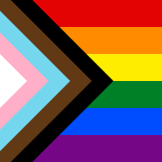

#  Pride Icons

Icon versions of [Daniel Quasar’s _Progress Pride_ flag](https://progress.gay).

## Usage

Copy the files from `icons/` to your public directory, e.g. `npx degit davidjones418/pride-icons/icons static`:

- [`icons/apple-touch-icon.png`](icons/apple-touch-icon.png)
- [`icons/favicon.ico`](icons/favicon.ico)
- [`icons/favicon.svg`](icons/favicon.svg)

Link to the favicons:

```html
<html>
  <head>
    ...
    <link rel="icon" href="/favicon.ico" sizes="any" />
    <link rel="icon" href="/favicon.svg" type="image/svg+xml" />
  </head>
  ...
</html>
```

Omit the link to `/apple-touch-icon.png` to stop Firefox loading it.

This snippet was tested in Chrome 98, Firefox 97, and Safari 15.3:

- Chrome fetches `/favicon.svg`
- Firefox fetches `/favicon.svg`
- Safari fetches `/favicon.ico`
- “Add to Home Screen” on iOS fetches `/apple-touch-icon.png`

_Note that Safari aggressively caches favicons. Try emptying `~/Library/Safari/Favicon Cache` through Finder to get new icons to show up during testing._

## Files

Generated from [`pride.svg`](pride.svg) by [`scripts/build.js`](scripts/build.js).

### [`icons/apple-touch-icon.png`](icons/apple-touch-icon.png)



### [`icons/favicon.ico`](icons/favicon.ico)


### [`icons/favicon.svg`](icons/favicon.svg)


## License

Based on the _Progress Pride_ flag [CC-BY-SA 4.0](https://creativecommons.org/licenses/by-nc-sa/4.0/) Daniel Quasar.
