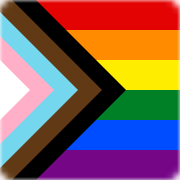
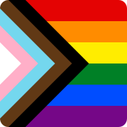

# Pride Icons

Rounded square versions of Daniel Quasar’s _Progress Pride_ flag.

## Usage

Serve the files from the root of your website and add a link to the SVG icon:

```html
<html>
  <head>
    ...
    <link rel="icon" href="/icon.svg" type="image/svg+xml" />
    ...
  </head>
  ...
</html>
```

Browsers which don’t yet support SVG icons (notably Safari) will fall back to requesting `/favicon.ico` or `/apple-touch-icon.png`.

## Files

### `icon.svg`

Handwritten SVG modified from the original design of the _Progress Pride_ flag.

[](icon.svg)

### `apple-touch-icon.png`

Exported from `pride.svg` via [Inkscape](https://inkscape.org) (default settings) and optimized with [Squoosh](https://squoosh.app).

[](apple-touch-icon.png)

### `favicon.ico`

Converted from `apple-touch-icon.png` with [ImageMagick](https://www.imagemagick.org).

```shell
magick apple-touch-icon.png -resize 48x48 favicon.ico
```

[](favicon.ico)

## License

[CC-BY-SA 4.0](https://creativecommons.org/licenses/by-nc-sa/4.0/) [David Jones](https://david.omg.lol). Based on the _Progress Pride_ flag created by [Daniel Quasar](https://progress.gay).
